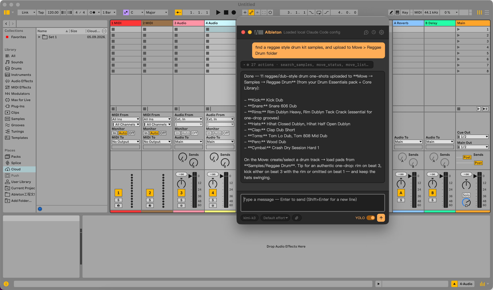
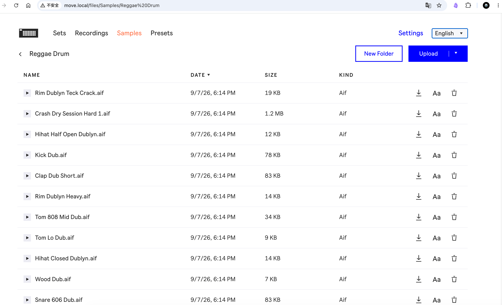

<p align="center">
  
</p>

<h1 align="center">AIbleton</h1>

<p align="center">
  <b>An AI music production agent inside Ableton Live.</b><br>
  AIbleton understands your Live Set, reasons about your music, and turns natural-language ideas into real changes inside Ableton Live.
</p>

<p align="center">
  Chat · Create · Analyze · Reason · Arrange · Edit · Control
</p>

<p align="center">
  Use <b>Codex, Claude, Gemini, or other compatible AI models</b> directly from your Live workflow.
</p>

<p align="center">
  <b>English</b> · <a href="README.zh-CN.md">中文</a>
</p>

<p align="center">
  <a href="https://github.com/freddyzhangxu/aibleton/releases"></a>
  <a href="https://github.com/freddyzhangxu/aibleton/releases"></a>
  <a href="LICENSE"></a>
</p>

---

## Download

**Current version: v0.9.8** (pre-release) — get it from the
[**Releases page**](https://github.com/freddyzhangxu/aibleton/releases):

| File | What it is |
|---|---|
| [AIbleton-0.9.8.ablx](https://github.com/freddyzhangxu/aibleton/releases/download/v0.9.8/AIbleton-0.9.8.ablx) | The Live extension — **required**. Drop it onto Live's **Settings → Extensions** page. |
| [AIbletonBar-0.9.8-macOS.zip](https://github.com/freddyzhangxu/aibleton/releases/download/v0.9.8/AIbletonBar-0.9.8-macOS.zip) | Optional macOS floating sidebar app. |
| [AIbletonBar-0.9.8-Windows.zip](https://github.com/freddyzhangxu/aibleton/releases/download/v0.9.8/AIbletonBar-0.9.8-Windows.zip) | Optional Windows floating sidebar app. |

No Node.js needed for end users — the extension runs inside Live's own Extension Host.

## What is AIbleton?

Most AI music tools can generate music or give you advice.

**AIbleton can actually work with the music you already have open in Ableton Live.**

Ask things like:

> "What is the current state of this project?"

> "Create a 4-bar bassline in A minor."

> "Make the bass less busy."

> "Analyze the arrangement and tell me what's missing."

> "Add an Auto Filter to the synth and sweep the cutoff."

The agent can **inspect your Live Set, understand musical context, reason about it, and perform changes directly in Live.**

## Screenshots

| AI agent dialog inside Live | AIbletonBar floating sidebar |
|:---:|:---:|
|  |  |

| AI finds samples and pushes them to Move over Wi-Fi | …and they land on the device |
|:---:|:---:|
|  |  |

## Core Capabilities

### Understand

- Analyze the current Live Set
- Inspect tracks, clips, MIDI and devices
- Detect key, track roles and musical statistics
- Analyze arrangement structure
- Analyze audio characteristics

### Reason

- Extract structured musical features from the Live Set
- Analyze relationships between tracks and sections
- Compare section contrast and similarity
- Understand arrangement arcs and musical roles
- Produce evidence-backed musical observations
- Use reference tracks for musical comparison

### Create & Arrange

- Generate MIDI and drum patterns
- Create and edit clips
- Generate audio with supported providers and refine it against measurable goals (crest, band energy, brightness) in a bounded auto-refine loop
- Build and modify arrangements
- Create sections from natural-language instructions
- Plan and verify section-specific changes

### Edit & Control

- Create and manage tracks and scenes
- Insert and control devices
- Change mixer and device parameters
- Control Ableton Live directly from the AI agent

### Search & Remember

- Search local sample libraries
- Search the web
- Maintain Artist Memory and musical preferences

### Ableton Move

- Analyze Move Sets
- Transfer samples
- Work with Move MIDI and projects
- Connect Move to the AI-assisted workflow

## How It Works

```text
User Intent
    ↓
AI Agent
    ↓
Understand Live Set
    ↓
Music Intelligence
    ├─ Musical Features
    ├─ Relationships
    ├─ Reasoning
    └─ Planning
    ↓
Creative Actions
    ↓
Ableton Live
    ↓
Updated Project
```

AIbleton separates the **AI model** from the **Live integration layer**, allowing you to choose different models while using the same tools to work with your music.

## Music Intelligence

AIbleton is built around a structured understanding of the musical state of a Live Set.

```text
Live Set
   ↓
Music State
   ↓
Musical Features
   ↓
Relationships
   ↓
Reasoning
   ↓
Creative Actions
   ↓
Agent
   ↓
Live
```

This moves AIbleton beyond simple command execution toward an agent that can **understand musical structure, relationships, context, and intent — then use that understanding to plan and perform changes.**

## Installation

### Requirements

- Ableton Live 12.4.5+
- Ableton Extensions SDK support
- An AI provider

Download the latest `.ablx` from the [Download](#download) section above and install it from:

**Ableton Live → Settings → Extensions**

AIbleton also provides an optional **AIbletonBar** floating interface for macOS and Windows.

## Development

```bash
git clone https://github.com/freddyzhangxu/aibleton.git
cd aibleton/AIbleton
npm install
npm start
```

See the repository documentation for development and SDK setup.

## Roadmap

AIbleton is continuing toward a deeper agentic music-production workflow:

- **State Diff & Snapshots** — understand and track project changes
- **Deeper Musical Understanding** — richer relationships, roles and arrangement intent
- **Deeper Ableton Integration** — take advantage of evolving Extensions SDK capabilities

## Status

AIbleton is an **open-source experimental project** built on the Ableton Extensions SDK.

The SDK is evolving, and APIs and capabilities may change.

> AIbleton is not affiliated with or endorsed by Ableton AG.
> "Ableton" and "Live" are trademarks of Ableton AG.

## License

[MIT](LICENSE)