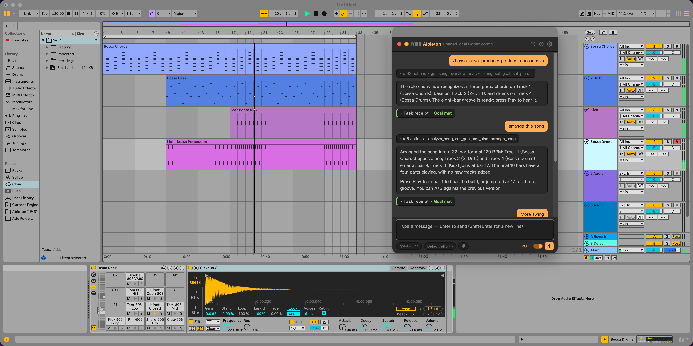
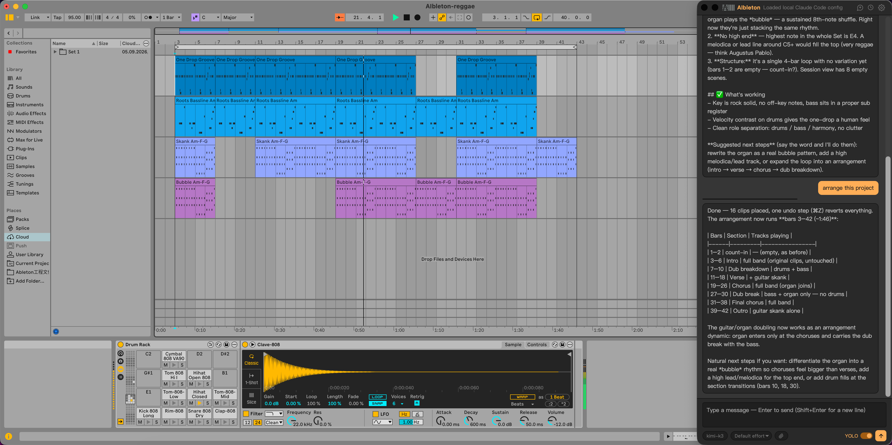

<p align="center">
  
</p>

<h1 align="center">AIbleton</h1>

<p align="center">
  住在 <b>Ableton Live 12</b> 里的 AI 助手 —— Claude、Codex 或 Gemini 随你选。<br>
  聊天、生成 MIDI 或音频、装载鼓组、搜索采样、直接控制设备与轨道，全程不用离开 Live。
</p>

<p align="center">
  <a href="README.md">English</a> · <b>中文</b>
</p>

<p align="center">
  <a href="https://github.com/freddyzhangxu/aibleton/releases"></a>
  <a href="https://github.com/freddyzhangxu/aibleton/releases"></a>
  <a href="LICENSE"></a>
</p>

---

## 下载

**当前版本：v0.9.2**（预发布）—— 前往
[**Releases 页面**](https://github.com/freddyzhangxu/aibleton/releases) 下载：

| 文件 | 说明 |
|---|---|
| [AIbleton-0.9.2.ablx](https://github.com/freddyzhangxu/aibleton/releases/download/v0.9.2/AIbleton-0.9.2.ablx) | Live 扩展本体 —— **必装**。拖进 Live 的 **设置 → Extensions** 页面即可。 |
| [AIbletonBar-0.9.2-macOS.zip](https://github.com/freddyzhangxu/aibleton/releases/download/v0.9.2/AIbletonBar-0.9.2-macOS.zip) | 可选的 macOS 悬浮侧边栏（版本号与扩展保持同步）。 |
| [AIbletonBar-0.9.2-Windows.zip](https://github.com/freddyzhangxu/aibleton/releases/download/v0.9.2/AIbletonBar-0.9.2-Windows.zip) | 可选的 Windows 悬浮侧边栏 —— Win+Alt+A 呼出（版本号与扩展保持同步）。 |

用户无需安装 Node.js —— 扩展运行在 Live 自带的 Extension Host 中。

## 简介

AIbleton 把 AI 对话助手直接放进 Ableton Live。对它说
*「做一个 140 BPM 的 4 小节 808 鼓型」*、*「给 2 轨加个 Auto Filter，截止频率扫到 800 Hz」*、
*「在我本地采样里找一条 tech house loop 拖进编排」* —— 它会直接在你的 Live Set 里完成。

它同时也是随身的操作指导：问它*「贝斯怎么对底鼓做侧链压缩？」*、
*「这条 loop 的 warp 在哪里设置？」*，它会一步步讲解操作方法 —— 或者直接帮你做完。

接入 Stable Audio 等 AI 音乐模型后，还能用一句话从零生成音频：loop 上编排，one-shot 进 Simpler。

项目包含两个部分：

| 组件 | 说明 |
|---|---|
| **[AIbleton/](AIbleton/)** | Live 12 扩展本体：聊天界面 + 本地助手服务，内置约 20 个读写 Live Set 的工具 |
| **[AIbletonBar/](AIbletonBar/)** | 原生悬浮侧边栏（macOS / Windows），把同一个聊天界面挂在 Live 旁边，IDE 式体验，**⌥⌘A** / **Win+Alt+A** 呼出 |

## 截图

| Live 内置 AI 助手对话框 | AIbletonBar 悬浮侧边栏 |
|:---:|:---:|
|  |  |

## 功能

- **在 Live 里聊天** —— 右键任意轨道 / 场景 / Clip → Extensions → **AIbleton: Open**，
  在模态对话框中与助手对话；
  同一界面也可以在浏览器打开 `http://localhost:17666`，或用 AIbletonBar。
- **模型自由选择** —— Claude、OpenAI Codex 或 Google Gemini，在对话框里随时切换。
  自动复用本地 CLI 凭证（Claude Code、Codex CLI 含 ChatGPT 账号登录、Gemini CLI），
  也可手动填写；工具栏的思考强度（Effort）选项可以在速度与推理深度之间取舍。
- **文件附件** —— 可附加图片或文本文件，也可以直接丢入 `.mid` 文件或整个 `.als`
  Live 工程：二进制音乐文件会被解析成紧凑的文本摘要供模型阅读，所以你可以问
  *「这条 loop 是什么调？」*、*「把这条 bassline 复刻到第 3 轨」*。
  点击选择、拖入窗口或 ⌘V 粘贴均可。
- **MIDI 生成与编辑** —— 自然语言生成编排视图或 Session 视图的 MIDI Clip，
  也可以读取并改写现有 Clip 里的音符，支持逐音符音高 / 时值 / 力度与摇摆（swing）。
- **一键 808 鼓组** —— 自动搭建 Drum Rack，用 Simpler 装载官方 808 采样，
  按 GM 风格音符表直接编程，出声即用。
- **采样搜索与导入** —— 搜索本地 Splice 同步目录、Ableton User Library、
  官方 Packs 与 Core Library，导入音频或装载到 Simpler。
- **AI 音频生成** —— 用 Stable Audio、ElevenLabs、MiniMax 或任意自定义 HTTP API
  （中转站、自托管 MusicGen、Suno 类服务，同步异步皆可）把文字描述渲染成音频并
  直接进工程：loop 上编排、one-shot 进 Simpler；文件落在 User Library，随取随用。
- **联网搜索（默认关闭）** —— 在 设置 → 联网搜索 打开后，助手可以搜网页
  （`web_search`，Bing 主引擎 + DuckDuckGo 自动兜底，均免 key，搜索语言跟随
  界面语言）并读取页面正文（`web_fetch`）：版本更新、价格、教程等时效问题
  直接查，粘贴的 URL 也能总结，回答附来源链接。只读、免确认，自动走系统代理。
- **设备控制** —— 插入设备（Operator、Auto Filter……），按模糊名称读写参数
  （"freq" → Filter Freq）。
- **轨道与场景操作** —— 创建 / 重命名 / 静音 / 独奏 / 布防轨道，调节音量与声像，
  创建与重命名场景，设置 BPM。
- **操作指导** —— 解答 Live 本身的使用问题（混音、warp、路由、快捷键……），
  在你工作的地方直接给出分步讲解。
- **多语言界面** —— 聊天界面支持 English、中文、Deutsch、Français、日本語、
  Español、Italiano，与 Live 自身的语言列表一致。

## 环境要求

- **Ableton Live 12**（12.4.5+），配套 Extensions SDK beta
- **Node.js ≥ 24.14.1** —— 仅开发者从源码构建时需要；安装 `.ablx` 的最终用户
  **无需**安装 Node.js（扩展运行在 Live 自带的 Extension Host 中）
- **任一 AI 服务商凭证** —— Claude、OpenAI Codex 或 Google Gemini。自动复用对应
  本地 CLI 的配置：Claude Code 的 `~/.claude/settings.json`、Codex CLI 的
  `~/.codex/auth.json`（API Key 或 ChatGPT 账号登录）、Gemini CLI 的
  `~/.gemini/.env`；也可用环境变量（`ANTHROPIC_*`、`OPENAI_*`、
  `GEMINI_API_KEY` / `GOOGLE_API_KEY`），或在对话框「设置 → AI 配置」里手动填写。
  扩展本身不存储任何敏感信息。
- **macOS 或 Windows** —— 仅 AIbletonBar 需要；扩展本体与平台无关

## 安装

### 普通用户 —— 直接安装 `.ablx`

需要 **Ableton Live 12.4.5 beta** 或更高版本。下载
[AIbleton-0.9.2.ablx](https://github.com/freddyzhangxu/aibleton/releases/download/v0.9.2/AIbleton-0.9.2.ablx) 后，
打开 Live 的 **设置 → Extensions** 页面，把 `.ablx` 文件拖进去即可 —— 无需 Node.js、无需命令行。

安装完成后：右键轨道、场景或 Clip → Extensions → **AIbleton: Open** —— 或在浏览器打开
`http://localhost:17666`。

### 开发者模式 —— 从源码构建运行

```sh
cd AIbleton
npm install

# .env 中的 EXTENSION_HOST_PATH 需指向 Live 的 Extension Host 模块
#（SDK 生成器会自动填写；Live 安装路径变动时请手动修改）

npm start        # 构建并在 Live 的 Extension Host 中运行
```

然后在 Live 里：右键轨道、场景或 Clip → Extensions → **AIbleton: Open** —— 或在浏览器打开
`http://localhost:17666`。

### 常用命令

```sh
npm start          # 开发构建 + 在 Live 中运行
npm run build      # 生产构建 src/extension.ts
npm run build:dev  # 开发构建（含 sourcemap，不压缩）
npm run package    # 生产构建 + 打包可分发的 .ablx 文件
```

### AIbletonBar（可选侧边栏）

macOS：

```sh
cd AIbletonBar
./build.sh            # 编译 AIbletonBar.app（swiftc 直编，无第三方依赖）
open AIbletonBar.app
```

Windows（可从 macOS 交叉编译，也可在 Windows 的 Git Bash 里跑 —— 需要 .NET SDK）：

```sh
cd AIbletonBar/windows
./build.sh            # 发布单文件 AIbletonBar.exe（WinForms + WebView2）
```

- **⌥⌘A**（macOS）/ **Win+Alt+A**（Windows）全局呼出 / 隐藏；面板吸附屏幕右缘、全高、置顶（macOS 下随所有 Space 显示）。
- 支持聊天里的文件附件功能，调起系统原生文件选择器。
- Live 未加载扩展时显示离线占位页，连上后自动恢复（3 秒轮询）。

## 工作原理

扩展在 Live 的 Extension Host 内启动一个本地 HTTP 服务（端口 `17666`）。
聊天页面通过一组基于 Extensions SDK 的工具与所选模型（Claude / Codex / Gemini）
对话 —— `get_song_overview`、`write_midi_clip`、`write_session_clip`、
`load_drum_kit`、`search_samples`、`import_audio_clip`、`generate_audio`、
`insert_device`、`set_device_parameter`、`set_track_mixer`、场景与速度工具等，
外加免 key 联网的 `web_search` / `web_fetch`。
每一句回答都可以直接读写当前打开的 Live Set。

```
┌────────────────────┐      ┌──────────────────────┐      ┌────────────────┐
│ 聊天界面           │      │ 助手服务             │      │ 模型 API       │
│（对话框 / 浏览器   │─────▶│ localhost:17666      │─────▶│ Claude / Codex │
│  / AIbletonBar）   │      │ + 约 20 个 Live 工具 │◀─────│ / Gemini       │
└────────────────────┘      │                      │      └────────────────┘
                            │                      │      ┌────────────────┐
                            │                      │─────▶│ 音频 API       │
                            │                      │◀─────│ Stable Audio / │
                            └──────────┬───────────┘      │ ElevenLabs /   │
                                       │ Extensions SDK   │ MiniMax /      │
                                       ▼                  │ 自定义 HTTP    │
                              ┌──────────────────┐        └────────────────┘
                              │ Ableton Live 12  │
                              │ （当前 Live Set）│
                              └──────────────────┘
```

`generate_audio` 是独立于聊天模型的另一套 provider 体系：独立密钥
（设置 → 音频生成），由服务端直接调用，不经过 LLM 转发。渲染结果存入
User Library › AIbleton，再由模型用 `import_audio_clip` / `load_sample`
放进工程。

## 项目结构

```
AIbleton/          Live 扩展（TypeScript）
├── src/extension.ts   入口 —— 注册右键菜单动作，启动服务
├── src/server.ts      助手服务 + 工具实现（Claude / Codex / Gemini）
├── src/audiogen.ts    音频生成 provider（Stable Audio / ElevenLabs / MiniMax / 自定义 HTTP）
├── src/websearch.ts   web_search（Bing + DuckDuckGo 兜底，免 key）+ web_fetch，代理感知
├── src/fileparsers.ts 把 .mid / .als 附件解析成文本摘要供模型阅读
├── ui/interface.html  聊天界面
├── scripts/           冒烟测试（npx tsx scripts/test-fileparsers.ts）
└── vendor/            Extensions SDK beta 包（已 gitignore，见下方说明）

AIbletonBar/       macOS 悬浮侧边栏（Swift，约 180 行，无依赖）
├── main.swift
├── build.sh           swiftc 编译 + ad-hoc 签名
└── Resources/         应用图标与 Logo
```

## 当前状态

AIbleton 现已开源。Ableton Extensions SDK 仍处于 **beta** 阶段，其安装包不允许
再分发，因此 `vendor/` 目录已被 gitignore —— 自行构建扩展需要先获取 SDK beta
权限（见 https://ableton.github.io/extensions-sdk/）。SDK beta 1 只提供右键菜单
和模态对话框，这正是 AIbletonBar 以独立侧边栏 App 形式存在的原因。

## 路线图

- **更深度的 Live 集成** —— 待 SDK 正式版提供面板 API 后，把侧边栏直接搬进 Live 内部。

## 免责声明

AIbleton 是独立的开源项目，与 Ableton AG 无任何隶属关系，亦未获得其背书。
"Ableton" 与 "Live" 是 Ableton AG 的商标。

## 许可证

[MIT](LICENSE)
